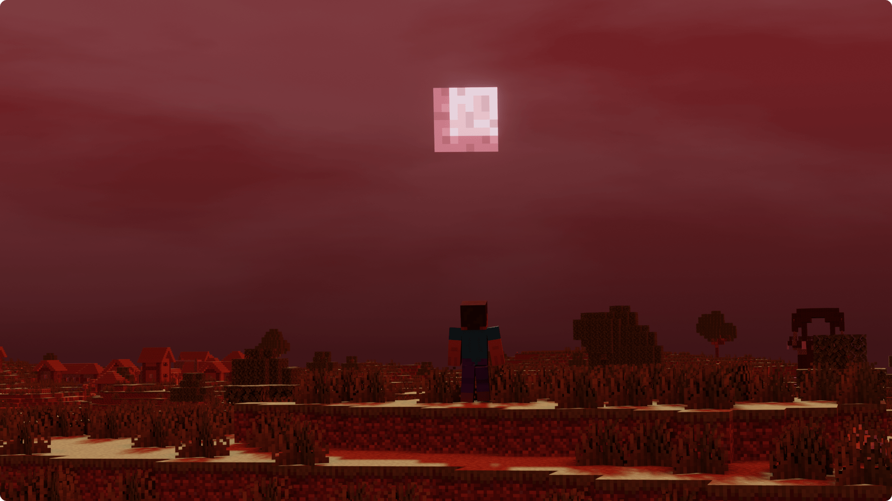
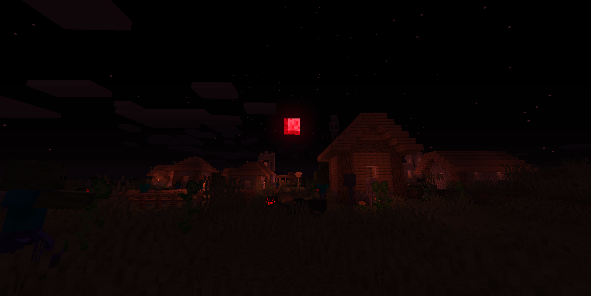
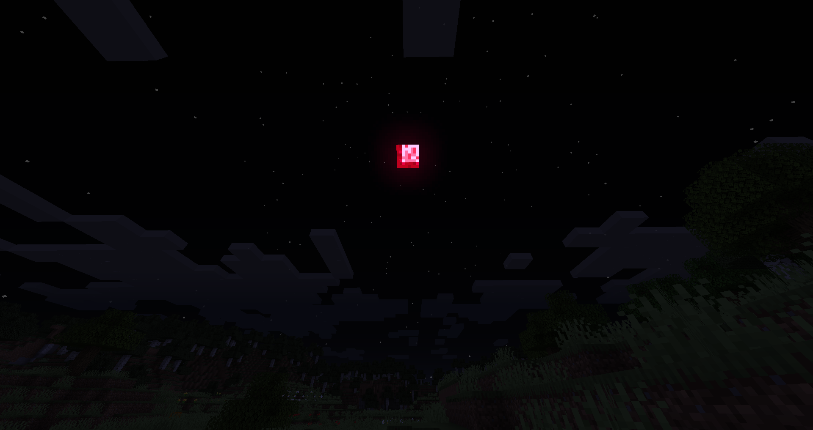

# Crimson Moon

Crimson Moon is a mod based on the popular [Blood Moon](https://terraria.gamepedia.com/Blood_Moon). Every 20 nights, a Crimson Moon will spawn, which is accompanied by an increase in mob spawn rates and more dangerous foes.

---

Crimson Moon has a number of config options which you can edit in `config/crimsonmoon.json5`. Each option has a comment that describes what it does.

Crimson Moon - and all the components that are bundled inside it - are available under the MIT license.

### Gallery

### Libraries
  - *World Data* by Draylar
  - *Omega Config* by Draylar