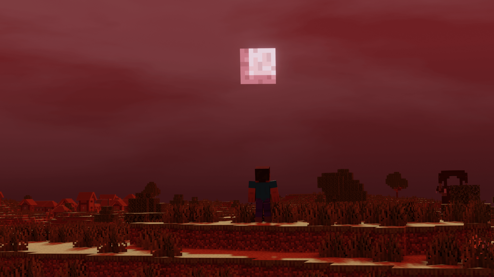

# Crimson Moon

Every so often... a Crimson Moon appears, accompanied by the howls of mobs across the lands.

Crimson Moon is a mod based on the popular [Blood Moon](https://terraria.gamepedia.com/Blood_Moon). Every 20 nights, a Crimson Moon will spawn, which is accompanied by an increase in mob spawn rates and more dangerous foes.

This mod was built for 1.15.2 Fabric. Forge ports will not be available.

### Configuration
Crimson Moon has a number of config options which you can edit in `config/crimsonmoon.json5`. Each option has a comment that describes what it does.

### Licensing
Crimson Moon is MIT, and you are free to use the code/assets in this repo as you wish.

### Gallery

